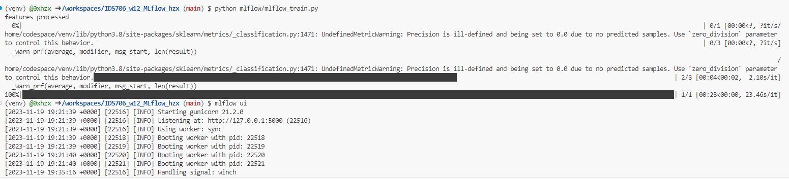
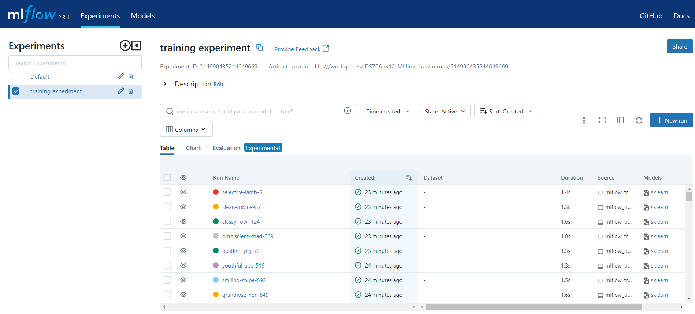
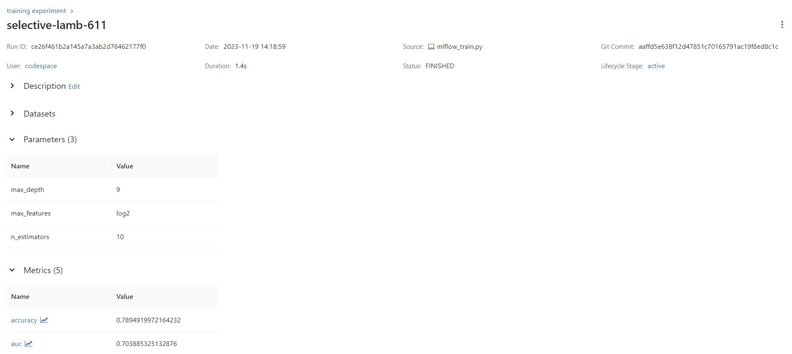
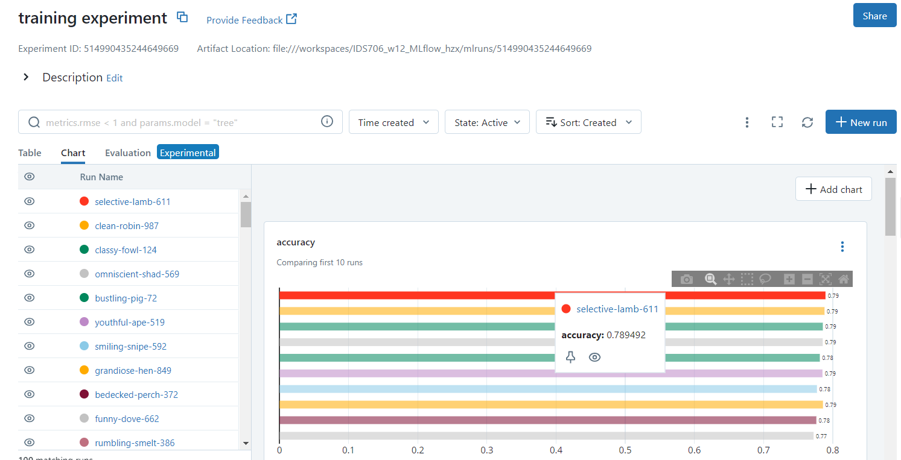

# Use MLflow to Manage an ML Project

## Purpose
In this repo, I experiment with MLflow to:

- track machine learning experiments based on:
  - metrics
  - hyper-parameters
  - source scripts executing the run
  - code version
  - notes & comments
- compare different runs between each other
- set up a tracking server locally
- deploy the model using MLflow Models

We use the **Random Forest Classifier** to predict the probability of a candidate to look for a new job or will work for the company.

## You should do

- Maybe you need to `yum install python3-pip`
- pipenv shell( activate environment )
- prepare the environment using `pip install -r requirements.txt`
- run `python mlflow_train.py`
- run `mlflow ui`

## About Dataset
Context and Content
A company which is active in Big Data and Data Science wants to hire data scientists among people who successfully pass some courses which conduct by the company. Many people signup for their training. Company wants to know which of these candidates are really wants to work for the company after training or looking for a new employment because it helps to reduce the cost and time as well as the quality of training or planning the courses and categorization of candidates. Information related to demographics, education, experience are in hands from candidates signup and enrollment.

This dataset designed to understand the factors that lead a person to leave current job for HR researches too. By model(s) that uses the current credentials,demographics,experience data **you will predict the probability of a candidate to look for a new job or will work for the company, as well as interpreting affected factors on employee decision**. The whole data divided to train and test . Target isn't included in test but the test target values data file is in hands for related tasks. A sample submission correspond to enrollee_id of test set provided too with columns : enrollee _id , target

### Inspiration
- Predict the probability of a candidate will work for the company
- Interpret model(s) such a way that illustrate which features affect candidate decision

## Following steps:

- `python mlflow_train.py`
  (You can stop it after 2 or 3 minutes, beacuse you have no need to wait until it complete)

- Return to the UI page, you will see experiment results

